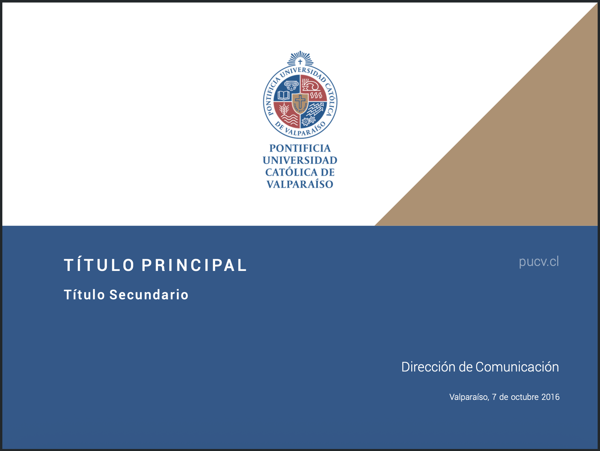
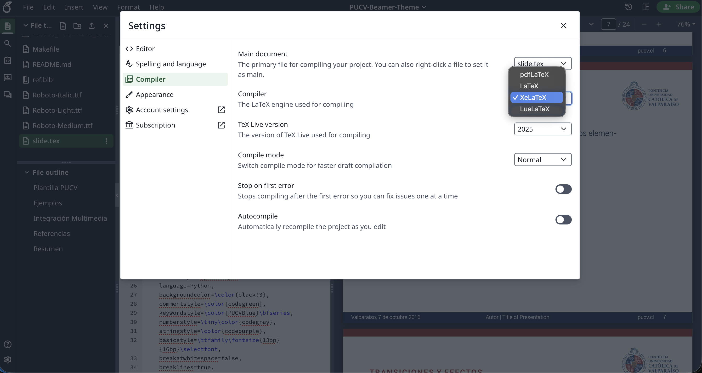

# Unofficial PUCV LaTeX Beamer Theme

An unofficial LaTeX Beamer template designed to match the official **Pontificia Universidad Católica de Valparaíso (PUCV)** graphic standards of 2016.



---

## ⚠️ Disclaimer

**This is an unofficial LaTeX template.** This project is not officially affiliated with, endorsed by, or maintained by the Pontificia Universidad Católica de Valparaíso. 

The official PowerPoint templates, logos, and graphic identity manuals are maintained by the **Dirección de Comunicación Estratégica** of PUCV. You can view the original standards and resources on the official [Normas Gráficas PUCV](https://www.pucv.cl/uuaa/direccion-de-comunicacion-estrategica/normas-graficas-pucv) page.

### Typography & Roboto Font License

This repository bundles the `Roboto` font files (Roboto Light, Roboto Medium, and Roboto Italic) to ensure compilation works out of the box. 

- **License:** The Roboto font family is developed by Google and licensed under the [Apache License, Version 2.0](https://www.apache.org/licenses/LICENSE-2.0).
- **Source:** The original font files and source details are available on [Google Fonts](https://fonts.google.com/specimen/Roboto).


---

## Repository Structure

- `slide.tex`: Main presentation source file containing theme configurations, styling layouts, and showcase frames.
- `Makefile`: Automation file to compile the document and clean up auxiliary LaTeX build files.
- `Escudo_PUCV-2016_color v.png` / `Escudo_PUCV-2016_color h.png`: High-resolution official transparent PNG logos.
- `Roboto-*.ttf`: Roboto font files required for compiling presentation text.
- `ref.bib`: BibTeX bibliography database containing reference citations.

---

## Requirements & Compilation

Compile it using `xelatex` or `lualatex`.

### Quick Compilation

A `Makefile` is provided to handle compilation with BibTeX references and automatically purge LaTeX auxiliary files. To build the PDF run:

```bash
make
```


### Manual Compilation

To compile manually with bibliography rendering:

```bash
xelatex slide.tex
bibtex slide
xelatex slide.tex
xelatex slide.tex
```

---

## Overleaf Compatibility

This template is fully compatible with [Overleaf](https://www.overleaf.com/).

### Import from GitHub
You can easily import this template directly into Overleaf using the **New Project** -> **Import from GitHub** functionality. Simply provide the repository URL:
`https://github.com/crispchris/PUCV-Beamer-Theme.git`

### Recommended Compiler (XeLaTeX)
To compile the document successfully on Overleaf, you must change the compiler to **XeLaTeX**:
1. Open the project in Overleaf and click on the **Menu** button at the top-left corner.
2. Under **Settings**, change the **Compiler** from pdfLaTeX to **XeLaTeX**.

